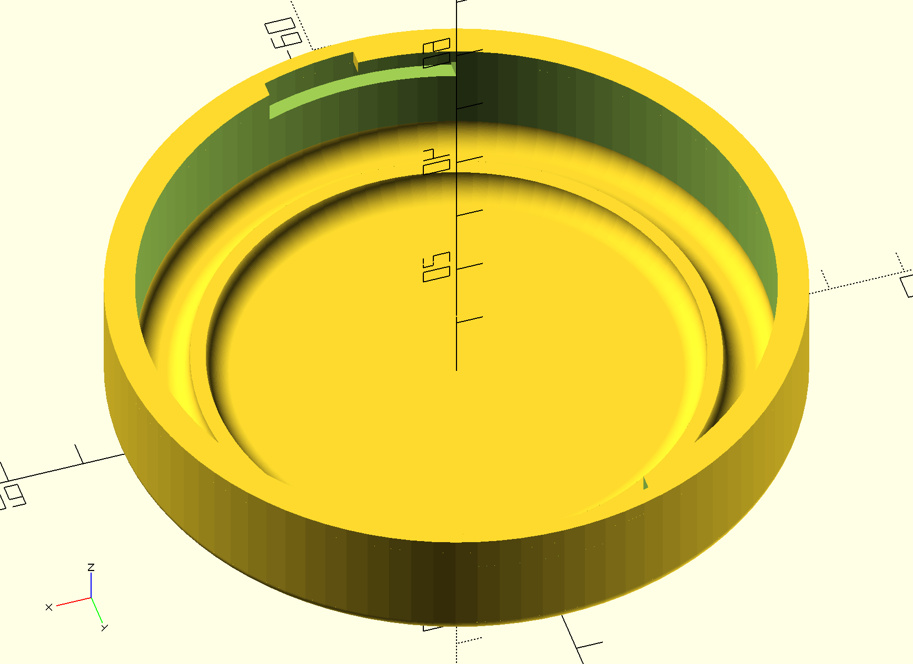

# Sencor SCG 2052WH Cap

This repository hosts the source code for a 3D model of the Sencor SCG 2052WH
coffee grinder cap.

https://www.sencor.com/electric-coffee-grinder/scg-2052

The purpose of this model is to be used for 3D printing a replacement cap as the
factory one has interlocking flaps that are very much prone to breaking.

I recommend printing the replacement cap in transparent filament to preserve the
ability to see the status of the ground coffee without taking the lid off.

This is a work in progress, see the `TODO` comments in the OpenSCAD script to
see what is left to do.

